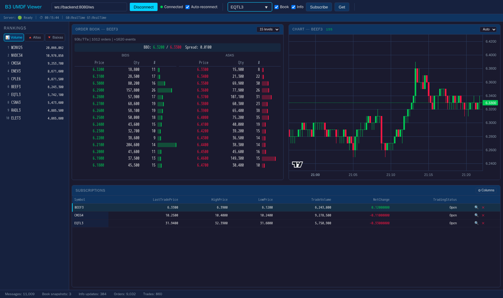

# B3MarketDataPlatform

Open-source C# consumer for [B3](https://www.b3.com.br/) market data over
the **Binary UMDF** (Unified Market Data Feed) protocol, encoded with
[SBE (Simple Binary Encoding)](https://github.com/FIXTradingCommunity/fix-simple-binary-encoding).

Uses the [`SbeSourceGenerator`](https://www.nuget.org/packages/SbeSourceGenerator/)
Roslyn source generator to produce zero-allocation, blittable C# structs
straight from the B3 SBE XML schema.



## Highlights

- **Zero-copy SBE decoding** — generated blittable structs, no heap
  allocation per packet.
- **PCAP replay with cross-channel sync** — timestamp-based priority
  queue merges the four UMDF channels (Incremental A/B, Instrument
  Definition, Snapshot Recovery) into one chronologically-correct stream.
- **Live multicast transport** — UDP multicast with ASM/SSM, configurable
  `SO_RCVBUF`, bounded internal queues, `recvmmsg`/`sendmmsg` batching.
- **Multi-channel** — process several channel groups (e.g. EQT + DRV)
  simultaneously, each with its own per-group hot path (zero locks).
- **Gap detection & snapshot recovery** — gaps trigger snapshot recovery,
  catch-up, and back to real-time without losing client state.
- **Per-instrument heal (differentiator)** — exploits B3's unified
  per-`SecurityID` `rptSeq` (validated against PCAP: 175 116 cross-template
  advances, zero violations) so a single-symbol gap stales **only that
  symbol**, not the whole channel. Per-instrument heal is universal
  (cold-start, normal gap, wide burst — all the same path); the
  channel-level state machine reduces to `WaitInstrumentDefinition →
  Streaming` with no Recovery state to fall back to. Eliminates the
  30 – 100 s blanket `Lost → Recovery → CatchUp` cycles imposed by
  conventional consumers on liquid feeds. See
  [RESILIENCE.md §2](./docs/RESILIENCE.md#2-per-instrument-recovery-unified-rptseq).
- **Cascading-recovery loop structurally impossible** — the historical
  slow-client → drop → Recovery → more drops feedback loop is gone:
  there is no Recovery state to enter (see RESILIENCE.md §4). Cold-start
  fanout suppression and a mass-stale fanout gate remain as residual
  defenses for analogous failure modes.
- **WebSocket subscription server** — compact binary protocol with `Book`,
  `Info`, and `News` channels (opt-in), unary `Get`, candle history (10 h of
  1 s candles), and 2 s rankings broadcast.
- **News pipeline (`News_5`)** — multi-part SBE reassembly with strict per-part
  validation, 5 s TTL, 16 MiB inflight cap, and zero-copy span delivery.
  Fragmented over the wire as `NewsBegin`/`NewsChunk`/`NewsEnd` so payloads
  larger than the `u16` framing length still flow through the same client
  pipeline. (Note: zero `News_5` occurrences observed in 8 sample PCAPs;
  pipeline is verified via synthetic fixtures.)
- **Layered backpressure** — bounded per-client outbound ring, hard
  pending-bytes cap with disconnect, outlier sweep, fanout suppression
  during recovery; clients can never impair feed consumption.
- **Web Worker frontend** — vanilla JS; worker owns the WebSocket and
  state, main thread only updates a pre-allocated DOM pool.
- **Operations** — `/health`, `/ready`, `/live` endpoints, 26
  `System.Diagnostics.Metrics` instruments (AOT-safe, zero NuGet deps),
  graceful SIGTERM drain, Docker hardening.

## Architecture

### Backend

```
┌─────────────────┐     ┌──────────────────┐
│ PcapReplay      │     │ Multicast UDP    │
│ (TimestampMerge)│     │ (MulticastSource)│
└────────┬────────┘     └────────┬─────────┘
         │  IPacketSource        │
         └──────────┬────────────┘
                    │
          ┌─────────▼─────────┐
          │ MultiFeedManager  │  ← routes by ChannelGroup
          └──┬──────────────┬─┘
             │              │
     ┌───────▼──────┐ ┌─────▼────────┐
     │ FeedHandler  │ │ FeedHandler  │   ← one per group
     │ (G0 / EQT)   │ │ (G1 / DRV)   │
     └───────┬──────┘ └─────┬────────┘
             │              │
     ┌───────▼──────┐ ┌─────▼────────┐   ← per-group, single-threaded
     │ BookManager  │ │ BookManager  │
     │ MarketDataMgr│ │ MarketDataMgr│
     │ GroupHandler │ │ GroupHandler │   (conflation buffers)
     └───────┬──────┘ └─────┬────────┘
             └──────┬───────┘
                    │
          SymbolRegistry (shared, FrozenDictionary)
                    │
       SubscriptionManager (central registry)
        ├─ ConcurrentDictionary + copy-on-write subscriptions
        ├─ subscribe / get routed to owning group's queue
        ├─ rankings aggregated across all groups
        └─ symbol registry promote (periodic FrozenDictionary rebuild)
                    │
                    ▼
              WebSocketHost
              (Kestrel, binary frames)
```

### Frontend (Web Worker)

```
┌──────────────────────────────────────────────────┐
│ Worker thread (worker.js)                         │
│                                                   │
│ WebSocket → parse binary → update state           │
│ (orders, trades, info, rankings, subscriptions)   │
│ compute MBP (bid/ask levels from order map)       │
│                                                   │
│ setInterval(16ms) → if dirty: postMessage         │
│ (render-ready frame with arrays/objects)          │
└─────────────────────┬────────────────────────────┘
                      │ postMessage (structured clone)
                      ▼
┌──────────────────────────────────────────────────┐
│ Main thread (app.js + ui.js)                      │
│                                                   │
│ onmessage → store in view → rAF render            │
│ DOM pool updates (.textContent only)              │
│ event delegation for UI actions                   │
│ postMessage commands back to worker               │
└──────────────────────────────────────────────────┘
```

## Projects

| Project | Description |
|---------|-------------|
| `B3.Umdf.Sbe` | SBE schema + source generator (generates all B3 message types) |
| `B3.Umdf.Transport` | UMDF packet header, multicast transport, `IPacketSource` / `IPacketSink` |
| `B3.Umdf.Feed` | Feed handler, gap detection, A/B dedup, message dispatch |
| `B3.Umdf.Book` | MBO book + per-symbol heal: `OrderBook`, `BookSide`, `BookManager`, `BookStore`, `SnapshotApplier`, `SymbolStateRegistry`, `StaleMboBuffer`, `MarketDataManager`, `SymbolRegistry`, `CandleAggregator` |
| `B3.Umdf.PcapReplay` | PCAP reader, UDP extractor, timestamp-merged replayer |
| `B3.Umdf.Server` | WebSocket subscription server: `WireProtocol`, `SubscriptionManager`, `SnapshotEmitter`, `OutlierSweeper`, `RankingsPublisher`, `RecoveryProgressPublisher`, `GroupConflationHandler`, `ClientSession`, `WebSocketHost`, `AppSettings` |
| `B3.Umdf.ConsoleApp` | CLI application — PCAP replay + optional WebSocket server + `AppMetrics` |

## Tests

| Project | Tests | Description |
|---------|-------|-------------|
| `B3.Umdf.Book.Tests` | 193 | Order book ops, snapshot apply, per-symbol registry, stale buffer (drop-oldest + protected floor), forced-heal escape, SecurityID reuse, candle aggregator, news reassembler, concurrency stress |
| `B3.Umdf.Feed.Tests` | 51 | Feed handler, gap detection, A/B dedup, channel-handler reorder buffer (256 packets), MultiFeedManager dispatch |
| `B3.Umdf.PcapReplay.Tests` | 18 | PCAP reader, UDP/VLAN/SLL extraction, timestamp-merge ordering |
| `B3.Umdf.Transport.Tests` | 16 | Packet source, multicast config, batch receive (`recvmmsg`) |
| `B3.Umdf.Server.Tests` | 103 | Subscription manager, snapshot emitter, outlier sweep, conflation, epoch reset, trade bust, news fan-out, wire protocol, client session, backpressure |
| `B3.Umdf.ConsoleApp.Tests` | 30 | CLI option parsing, env-var precedence, multicast config validation |

```bash
dotnet build
dotnet test
```

## Quick start (Docker)

```bash
docker compose up --build
```

- **Backend** on `:8080` (WebSocket + REST), **frontend** on `:3000`.
- Open <http://localhost:3000>, click **Connect**, then subscribe to a
  symbol shown in the rankings panel.

For the split publisher / consumer topology that exercises the live UDP
path, the full CLI / env-var reference, and the multicast JSON format,
see [docs/OPERATIONS.md](docs/OPERATIONS.md) and
[docs/CONFIGURATION.md](docs/CONFIGURATION.md).

### Pre-built backend image (GHCR)

The backend is published to GitHub Container Registry on every push to
`main` and on every `vX.Y.Z` git tag. Pull it directly instead of
building from source:

```bash
docker pull ghcr.io/pedrosakuma/b3-marketdata:latest
# or pin a release:
docker pull ghcr.io/pedrosakuma/b3-marketdata:v1.0.0
```

Tags published per build:

- `latest` — tip of `main`.
- `vX.Y.Z`, `vX.Y` — semver tags (on git tag pushes).
- `sha-<short>` — exact commit (immutable, recommended for production pins).
- `<branch>` — tip of any pushed branch.

Use the GHCR image with the existing compose stack via the override:

```bash
docker compose -f docker-compose.yml -f docker-compose.ghcr.yml up
# pin a specific tag:
MARKETDATA_TAG=v1.0.0 docker compose -f docker-compose.yml -f docker-compose.ghcr.yml up
```

The frontend is a dev-only demo UI and is **not** published to GHCR; it
continues to build locally from `./frontend` in both modes. Downstream
services (e.g. `B3TradingPlatform`) consume the backend's WebSocket
directly — see [docs/WEBSOCKET_API.md](docs/WEBSOCKET_API.md).

## B3 schema

This project uses the [B3 Market Data Messages v2.2.0](https://www.b3.com.br/en_us/solutions/platforms/puma-trading-system/for-developers-and-vendors/binary-umdf/)
SBE XML schema. The schema's `<!DOCTYPE xml>` declaration is removed
because .NET's `XmlReader` prohibits DTD processing by default. This is
the only modification to the original B3 schema.

## Documentation

| Document | What's inside |
|----------|---------------|
| [docs/OPERATIONS.md](docs/OPERATIONS.md) | Running locally and in Docker, web viewer screenshots, health endpoints, metrics, backpressure summary, graceful shutdown, TLS, profiling |
| [docs/CONFIGURATION.md](docs/CONFIGURATION.md) | CLI options, full `UMDF_*` environment variable reference, multicast JSON config, host kernel tuning, replay-speed range |
| [docs/WEBSOCKET_API.md](docs/WEBSOCKET_API.md) | **Consumer-facing landing for the WebSocket distribution layer**: stability label, breaking-change policy, "reference price" quickstart for downstream apps (e.g. risk modules) |
| [docs/WEBSOCKET-PROTOCOL.md](docs/WEBSOCKET-PROTOCOL.md) | Wire framing, message catalog, hex examples, subscription / reconnect / slow-consumer flows, candle chunking |
| [docs/PERFORMANCE.md](docs/PERFORMANCE.md) | Hot-path design, zero-copy decoding, MPSC ring, broadcaster decoupling, coalescing, benchmarks |
| [docs/RESILIENCE.md](docs/RESILIENCE.md) | Failure modes, gap recovery, fanout suppression, slow-consumer layered defenses, memory bounds, operational playbook |
| [docs/NOISY-NEIGHBOUR.md](docs/NOISY-NEIGHBOUR.md) | Behaviour under host-level resource contention, scheduler jitter probe, deployment hardening (cpuset, k8s static CPU manager, NIC IRQ pinning, sysctls) |
| [pedrosakuma/SbeB3Exchange](https://github.com/pedrosakuma/SbeB3Exchange) | **Companion repo:** stateful B3 exchange simulator (TCP EntryPoint + UMDF multicast publisher) — designed to be run as a 24/7 simulated venue against this consumer |

## References

- [B3 Binary UMDF Developer Page](https://www.b3.com.br/en_us/solutions/platforms/puma-trading-system/for-developers-and-vendors/binary-umdf/)
- [B3 Binary Market Data — Client Portal (SBE specs, schemas, release notes)](https://clientes.b3.com.br/en/w/binary-market-data)
- [B3 SBE PCAP samples (public Azure storage)](https://mktdatabinario.z15.web.core.windows.net/PCAPS/BinaryUMDF/SiteB3/) — downloaded by `tools/pcap/download-pcaps.sh`
- [SbeSourceGenerator](https://github.com/pedrosakuma/SbeSourceGenerator)
- [FIX Simple Binary Encoding](https://github.com/FIXTradingCommunity/fix-simple-binary-encoding)

## License

[MIT](LICENSE)
