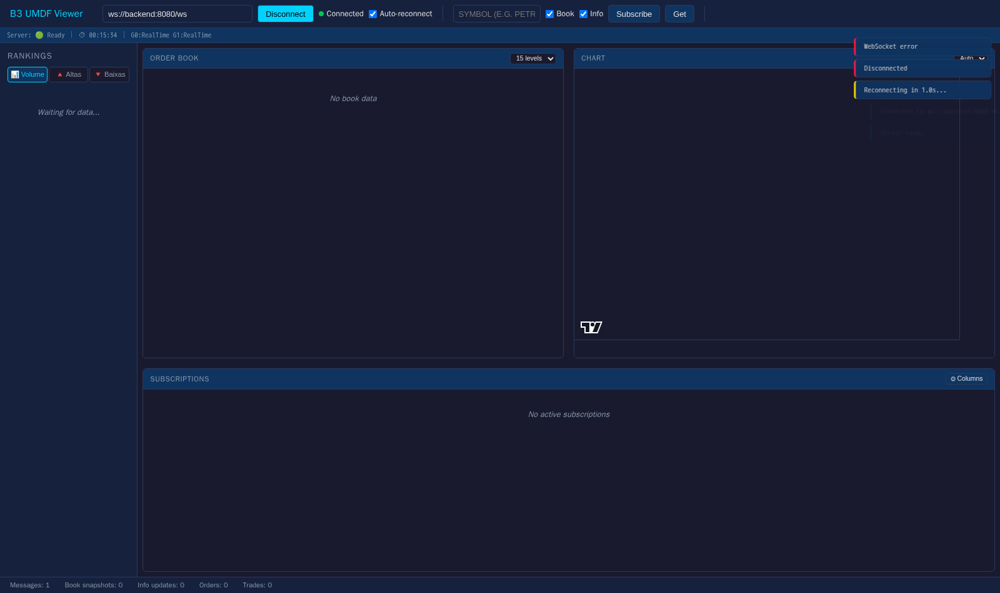
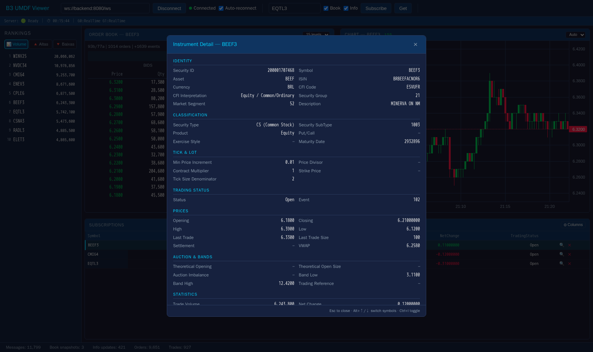
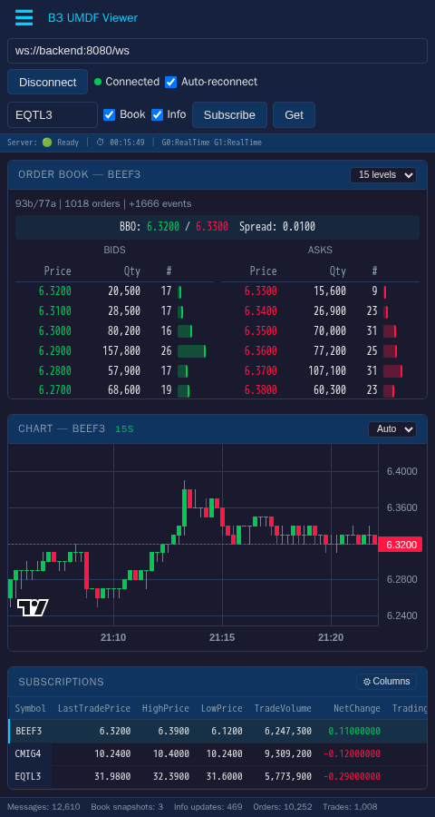

# Operations

How to run, observe, and operate the consumer in development and
production-like environments.

## Running locally

### Prerequisites

- [.NET 10 SDK](https://dotnet.microsoft.com/download)
- **For multicast deployments (production / `docker-compose.multicast.yml`):**
  raise the host kernel UDP receive buffer ceiling — the Linux default
  (`net.core.rmem_max ≈ 208 KiB`) silently clamps the consumer's requested
  16 MiB sockets and causes packet loss under burst (snapshot recovery,
  market open, instrument-definition cycle). The consumer logs an explicit
  warning at startup when this happens. Apply once on the host:

  ```bash
  sudo sysctl -w net.core.rmem_max=33554432 net.core.rmem_default=33554432
  # persist across reboots:
  echo 'net.core.rmem_max=33554432'      | sudo tee /etc/sysctl.d/99-umdf.conf
  echo 'net.core.rmem_default=33554432'  | sudo tee -a /etc/sysctl.d/99-umdf.conf
  ```

  See [`docs/CONFIGURATION.md`](CONFIGURATION.md#required-host-kernel-tuning-linux--wsl2--docker)
  for full details (per-channel buffer sizing, WSL2 persistence, container caveats).

### Build & test

```bash
dotnet build
dotnet test
```

### PCAP samples

B3 publishes sample PCAPs for development on a public Azure storage:

- Index page: <https://mktdatabinario.z15.web.core.windows.net/>
- Direct folder: <https://mktdatabinario.z15.web.core.windows.net/PCAPS/BinaryUMDF/SiteB3/>

A helper script downloads and extracts the 8 files used by the default
multi-channel setup (EQT + DRV, all four channel types each):

```bash
./tools/pcap/download-pcaps.sh
```

### Single-channel replay

```bash
dotnet run --project src/B3.Umdf.ConsoleApp -- \
  pcap/20250331_MBO_084_EQT_Incremental_FeedA.pcap \
  pcap/20250331_MBO_084_EQT_Incremental_FeedB.pcap \
  pcap/20250331_MBO_084_EQT_InstrumentDefinition.pcap \
  pcap/20250331_MBO_084_EQT_SnapshotRecovery.pcap \
  --ws-port 8080 --speed 5
```

### Multi-channel replay

```bash
dotnet run --project src/B3.Umdf.ConsoleApp -- \
  --pcap-prefix pcap/20250331_MBO_084_EQT \
  --pcap-prefix pcap/20250929_MBO_072_DRV \
  --ws-port 8080 --speed 5
```

### Live multicast

```bash
dotnet run --project src/B3.Umdf.ConsoleApp -- \
  --multicast-config config/multicast-sample.json \
  --ws-port 8080
```

### PCAP → multicast publisher

Same merged PCAP timeline, but published to multicast (publisher-only
mode — does **not** start the feed/WebSocket pipeline in the same
process). Run the publisher and the consumer as separate processes.

```bash
dotnet run --project src/B3.Umdf.ConsoleApp -- \
  --replay-to-multicast \
  --multicast-config config/multicast-sample.json \
  --pcap-prefix pcap/20250331_MBO_084_EQT \
  --pcap-prefix pcap/20250929_MBO_072_DRV \
  --speed 1
```

## Docker Compose

### In-process replay (default)

```bash
docker compose up --build
```

- **Backend** (port 8080): .NET app replaying PCAPs with WebSocket server.
- **Frontend** (port 3000): nginx serving the web viewer.

Open <http://localhost:3000>, click **Connect** (the WS URL is pre-filled
to `ws://localhost:8080/ws`), then subscribe to a symbol.

### Split publisher + consumer (validates UDP path)

```bash
docker compose -f docker-compose.multicast.yml up --build
```

- **Publisher**: PCAP replay → multicast.
- **Consumer**: live multicast → WebSocket.
- **Frontend**: static web viewer.

Both `./pcap` and `./config` are mounted. The publisher shares the
consumer's network namespace so multicast send/receive happens inside
the same network stack, sidestepping the usual Docker bridge / WSL2
multicast delivery issues. Default config: `config/multicast-compose.json`.

### Common knobs

```bash
# Both equities and derivatives (default)
docker compose up --build

# Derivatives only at real-time speed
PCAP_PREFIX=20250929_MBO_072_DRV REPLAY_SPEED=1 docker compose up --build

# Multi-channel explicit
PCAP_PREFIX=20250331_MBO_084_EQT,20250929_MBO_072_DRV docker compose up --build
```

Full env-var reference: [CONFIGURATION.md](CONFIGURATION.md).

## Web viewer

The frontend is a vanilla-JS Web Worker app served by nginx. It connects
to the WebSocket server, subscribes to instruments, and renders the live
order book, candle chart, info, trades and rankings.

### Dashboard — first connect

Top bar shows connection status and per-group feed state
(`G0:RealTime G1:RealTime`). The left rail (rankings) is broadcast to
every connected client every 2 s.



### Subscribed instrument

Subscribing publishes a `Subscribe` frame; the server replies with
`SubscribeOk`, then a `BookSnapshot` + `InfoSnapshot` + chunked
`CandleSnapshot`s, then incrementals stream live. The bottom panel lists
all active subscriptions with their info fields.


### Instrument detail modal

Clicking the magnifier icon next to a subscription fetches
`GET /instrument/{symbol}` and renders the full SBE `SecurityDefinition`
(identity, classification, tick & lot, trading status, prices, auction
& bands, statistics, plus repeating groups for underlyings, legs and
attributes when present).



### Mobile / tablet

The layout collapses to a single column under 600 px and the sidebar
turns into a slide-out drawer triggered by the hamburger button.



## Health endpoints

When the WebSocket server is active (`--ws-port`), HTTP endpoints are
served on the same port:

| Endpoint | Description |
|----------|-------------|
| `GET /health` | JSON: status, uptime, feed group states, last packet timestamps |
| `GET /ready` | `200` when all groups RealTime, `503` otherwise (readiness probe) |
| `GET /live` | Always `200` (liveness probe) |
| `GET /symbols?q=PREFIX&limit=N` | JSON: list of registered symbols matching prefix |
| `GET /instrument/{symbol}` | JSON: full instrument metadata including SecurityDefinition groups |

```bash
curl http://localhost:8080/health | jq
# {"status":"ready","uptime":"00:05:32","feedGroups":{"G0":"RealTime","G1":"RealTime"},...}
```

## Metrics

OTEL-compatible metrics via `System.Diagnostics.Metrics` (zero NuGet
dependencies, fully AOT-safe).

**Meter name:** `B3.Umdf.Consumer`

```bash
# one time
dotnet tool install -g dotnet-counters

# All instruments for a running process
dotnet-counters monitor --counters B3.Umdf.Consumer --process-id <PID>

# Specific subset
dotnet-counters monitor --counters B3.Umdf.Consumer[b3.umdf.feed.packets,b3.umdf.book.trades] --process-id <PID>
```

All instruments are **pull-based** (`ObservableCounter`/`ObservableGauge`)
— zero overhead on the hot path. `dotnet-counters` computes rates
automatically.

### Feed

| Metric | Type | Tags | Description |
|--------|------|------|-------------|
| `b3.umdf.feed.packets` | Counter | `group` | Packets received from feed |
| `b3.umdf.feed.duplicates` | Counter | `group` | Duplicate packets skipped |
| `b3.umdf.feed.gaps` | Counter | `group` | Sequence gaps detected |
| `b3.umdf.feed.instrument_definitions` | Counter | `group` | Instrument definitions received |
| `b3.umdf.feed.state` | Gauge | `group` | 0=WaitInstrDef, 1=WaitSnapshot, 2=CatchUp, 3=RealTime, 4=Recovery |
| `b3.umdf.feed.last_packet_age` | Gauge | `group` | Milliseconds since last packet (stale feed) |
| `b3.umdf.feed.queue_depth` | Gauge | `group` | Pending packets in feed queue |

### Book

| Metric | Type | Tags | Description |
|--------|------|------|-------------|
| `b3.umdf.book.orders_added` | Counter | `group` | Orders added to books |
| `b3.umdf.book.orders_updated` | Counter | `group` | Order updates applied |
| `b3.umdf.book.orders_deleted` | Counter | `group` | Orders deleted from books |
| `b3.umdf.book.trades` | Counter | — | Trades processed |
| `b3.umdf.book.parse_errors` | Counter | `group` | Book SBE parse errors |
| `b3.umdf.book.crossings` | Counter | `group` | Bid/ask crossing transitions |
| `b3.umdf.book.delete_not_found` | Counter | `group` | Deletes on non-existent orders |
| `b3.umdf.book.null_price_skips` | Counter | `group` | New orders skipped due to null price |
| `b3.umdf.book.null_price_deletes` | Counter | `group` | Updates with null price converted to deletes |
| `b3.umdf.book.active` | Gauge | `group` | Active order books |
| `b3.umdf.persymbol.snapshots_healed` | Counter | `group` | Per-symbol snapshots accepted and applied |
| `b3.umdf.persymbol.snapshots_rejected_too_old` | Counter | `group` | Snapshots rejected (snapshot.rptSeq < MinHeal). Sustained growth = recovery loop |
| `b3.umdf.persymbol.snapshots_skipped_healthy_ahead` | Counter | `group` | Snapshots skipped because symbol is already ahead |
| `b3.umdf.persymbol.snapshots_missing_rptseq` | Counter | `group` | Snapshots missing rptSeq metadata |
| `b3.umdf.persymbol.channel_gaps_absorbed` | Counter | `group` | Channel-level gaps absorbed via per-symbol heal (no Recovery escalation) |
| `b3.umdf.persymbol.stale_buffer_bytes` | Gauge | `group` | Bytes currently held in StaleMboBuffer |
| `b3.umdf.persymbol.stale_buffer_dropped_persymbol_cap` | Counter | `group` | MBO msgs dropped on per-symbol cap (newest dropped) |
| `b3.umdf.persymbol.stale_buffer_dropped_global_cap` | Counter | `group` | MBO msgs dropped on global byte cap |
| `b3.umdf.persymbol.stale_buffer_hot_promotions` | Counter | `group` | Symbols promoted from normal cap (8 192) to hot cap (65 536) |
| `b3.umdf.persymbol.stale_buffer_evicted_safe_below_floor` | Counter | `group` | Oldest msg evicted at hot cap with `rptSeq < ProtectedFloor` (safe — covered by in-flight snapshot) |
| `b3.umdf.persymbol.stale_buffer_evicted_unsafe` | Counter | `group` | Oldest msg evicted at hot cap with `rptSeq >= ProtectedFloor` (unsafe — bumps MinHeal, may force resnapshot). **Sustained growth indicates pathological loss; consider raising hot cap.** |

### Market data

| Metric | Type | Tags | Description |
|--------|------|------|-------------|
| `b3.umdf.market_data.updates` | Counter | — | Market data updates |
| `b3.umdf.market_data.status_changes` | Counter | — | Security status changes |
| `b3.umdf.market_data.forward_trades` | Counter | — | Forward trades |
| `b3.umdf.market_data.trade_busts` | Counter | — | Trade busts |
| `b3.umdf.market_data.execution_summaries` | Counter | — | Execution summaries |
| `b3.umdf.market_data.parse_errors` | Counter | `group` | Market data SBE parse errors |
| `b3.umdf.instruments.active` | Gauge | `group` | Active instruments |
| `b3.umdf.symbols.registered` | Gauge | — | Total registered symbols |

### Server

| Metric | Type | Tags | Description |
|--------|------|------|-------------|
| `b3.umdf.server.clients` | Gauge | — | Connected WebSocket clients |
| `b3.umdf.server.upstream_conflated` | Gauge | — | Pending events in conflation buffers |
| `b3.umdf.server.client_queue_depth` | Gauge | `client` | Per-client outbound queue depth |
| `b3.umdf.server.messages_sent` | Counter | `client` | Messages sent to WebSocket clients |
| `b3.umdf.server.bytes_sent` | Counter | `client` | Bytes sent to WebSocket clients |
| `b3.umdf.server.events_received` | Counter | `group` | Events received into conflation |
| `b3.umdf.server.events_flushed` | Counter | `group` | Events flushed from conflation to clients |

Adding a Prometheus `/metrics` endpoint or an OTLP exporter requires only
the corresponding NuGet package — no instrumentation changes.

## Backpressure & slow clients

Layered defense (full design: [RESILIENCE.md](RESILIENCE.md#slow-consumer-protection)):

1. **Bounded per-client outbound ring** (`UMDF_CLIENT_CHANNEL_CAPACITY`, default 4096) — feed thread never blocks on a slow client.
2. **Hard pending-bytes cap** (`UMDF_CLIENT_MAX_PENDING_BYTES`, default 4 MiB) — exceeded → WebSocket close `PolicyViolation "slow consumer"`.
3. **Outlier sweep** (1 Hz) — disconnects clients above `max(median × multiplier, minBytes)`, gated on aggregate pressure crossing `UMDF_CLIENT_OUTLIER_PRESSURE_PCT`.
4. **Fanout suppression at cold-start + mass-stale gate** — fanout is suppressed during `WaitInstrumentDefinition` and re-engages when ≥ 50 % of symbols are Stale (e.g. `ChannelReset_11`, mass loss). On release, all Book subscribers in the group receive a fresh snapshot. Per-instrument heal absorbs ordinary gaps without touching fanout.
5. **Snapshot rate-limit** (`UMDF_MAX_SNAPSHOT_REQUESTS_PER_BATCH`, default 32/packet) — bounds dispatch-thread allocation under connect storms.

Disconnected clients should reconnect and re-subscribe; they will
receive fresh snapshots and resume cleanly.

## Graceful shutdown

The application handles `SIGTERM` (containers) and `SIGINT` (Ctrl+C):

1. Stop accepting new connections.
2. Stop the feed (no new data).
3. Drain in-flight WebSocket writes (`UMDF_SHUTDOWN_DRAIN_SECONDS`, default 5 s).
4. Stop the server.

## TLS (HTTPS / `wss://`)

Kestrel natively supports HTTPS. Configure via environment variables:

```bash
ASPNETCORE_URLS=https://0.0.0.0:8443
ASPNETCORE_Kestrel__Certificates__Default__Path=/certs/cert.pfx
ASPNETCORE_Kestrel__Certificates__Default__Password=changeit
```

## Profiling

```bash
dotnet tool install -g dotnet-trace   # one time
./tools/profile/profile.sh
```

The script captures a `dotnet-trace` against the running consumer; load
the resulting `.nettrace` in PerfView or convert it to speedscope via
`dotnet-trace convert`.
