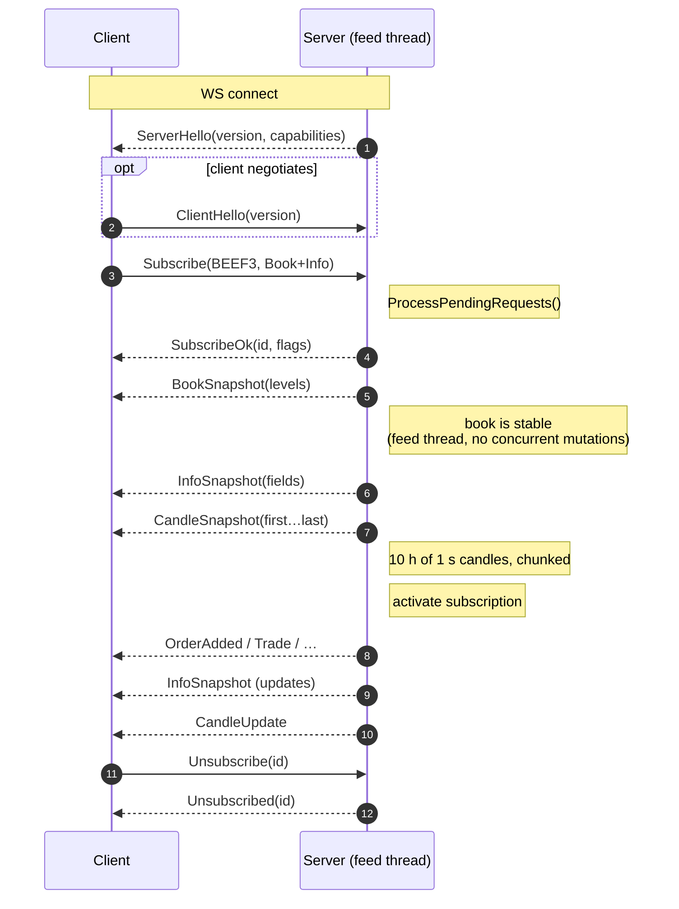
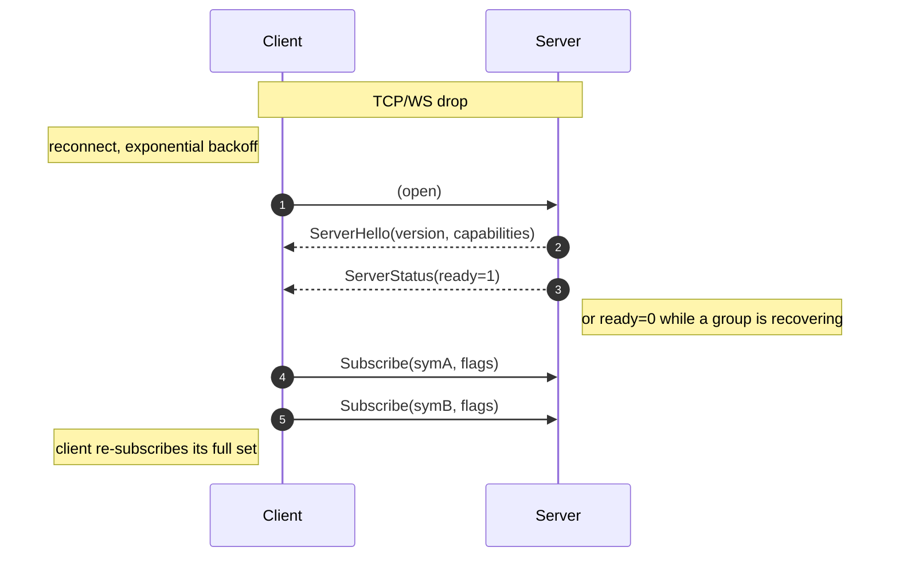

# WebSocket Binary Protocol

**Protocol version: 2** (`ProtocolVersion = 2`). See the
[Forward-Compatibility Contract](#forward-compatibility-contract) for the rules
that keep every future change additive.

The server speaks a compact, length-prefixed binary protocol over a single
WebSocket. All numeric fields are **little-endian** (the protocol is LE-only; a
big-endian runtime is rejected).

- Default URL: `ws://<host>:<ws-port>/ws` (e.g. `ws://localhost:8080/ws`).
- Frames are WebSocket **binary** messages.
- **A single WebSocket binary message MAY contain multiple wire frames**
  concatenated back-to-back (*coalescing*). The server batches whatever is
  queued for a client during its per-client `UMDF_CLIENT_COALESCE_WINDOW_MS`
  window into one `SendAsync`. Decoders **MUST** therefore treat each WS message
  as a stream: read the `messageLength` at the current offset, consume that many
  bytes, advance, and repeat until the message is drained — never assume one WS
  message equals one wire frame. See
  [Consuming coalesced messages](#consuming-coalesced-messages).

## Framing

Every message starts with a fixed **8-byte** header:

```
 0               1               2               3
 0 1 2 3 4 5 6 7 0 1 2 3 4 5 6 7 0 1 2 3 4 5 6 7 0 1 2 3 4 5 6 7
+-+-+-+-+-+-+-+-+-+-+-+-+-+-+-+-+-+-+-+-+-+-+-+-+-+-+-+-+-+-+-+-+
|                     messageLength (u32)                       |
+-+-+-+-+-+-+-+-+-+-+-+-+-+-+-+-+-+-+-+-+-+-+-+-+-+-+-+-+-+-+-+-+
|       messageType (u16)       |      headerFlags (u16)        |
+-+-+-+-+-+-+-+-+-+-+-+-+-+-+-+-+-+-+-+-+-+-+-+-+-+-+-+-+-+-+-+-+
|                          payload … (@8)                       |
```

- `messageLength` (`u32`) is the total frame size **including the 8-byte header
  itself**. It is authoritative: decoders MUST use it to find the next frame and
  to skip trailing bytes they do not understand.
- `messageType` (`u16`) identifies the frame.
- `headerFlags` (`u16`) is `0` in protocol v2. Reserved for future transport
  features (e.g. compression / fragmentation). A receiver that sees **any**
  header-flag bit it does not understand **MUST reject the frame / close the
  connection** — an unknown bit may change how the payload is interpreted.
- The payload always starts at byte offset **8**.
- Maximum single frame size: **16 MiB** (`MaxFrameLength`, a DoS guard against a
  bogus `u32` length). Frames larger than this are rejected.

## Consuming coalesced messages

Because one WebSocket binary message can pack many wire frames, a consumer
splits them in a loop driven entirely by `messageLength`:

```
offset = 0
while offset < wsMessage.length:
    length = readU32LE(wsMessage, offset)          # total frame size incl. 8-byte header
    if length < 8 or offset + length > wsMessage.length:
        drop rest of message (truncated/corrupt)   # should not happen from a healthy server
    type        = readU16LE(wsMessage, offset + 4)
    headerFlags = readU16LE(wsMessage, offset + 6)  # reject if any unknown bit is set
    payload     = wsMessage[offset + 8 : offset + length]
    dispatch(type, payload)
    offset += length
```

Sizing the receive buffer:

- A single **frame** never exceeds `MaxFrameLength` (16 MiB). A single coalesced
  **WS message** is bounded by the server's per-client outbound cap
  (`UMDF_CLIENT_MAX_PENDING_BYTES`, default 4 MiB), so in practice a message
  stays well under 16 MiB.
- Consumers should **not** pre-allocate the maximum. Start with a small buffer
  (the reference SDK uses 64 KiB) and **grow on demand** — doubling up to a
  16 MiB ceiling — only for the rare batch that overflows it. This keeps
  steady-state memory at a few KiB per connection while still tolerating a large
  coalesced burst; a message that would exceed the 16 MiB ceiling is treated as
  a protocol violation and the connection is closed.

## Message types

```
Client → Server                 Server → Client
─────────────────────────────   ─────────────────────────────────
ClientHello       0x00A1        ServerHello         0x00A0
Subscribe         0x0001        SubscribeOk         0x0010
Unsubscribe       0x0002        SubscribeError      0x0011
Get               0x0003        Unsubscribed        0x0012
                                BookSnapshot        0x0020
                                InfoSnapshot        0x0021
                                LevelSnapshot       0x0022
                                OrderAdded          0x0030
                                OrderUpdated        0x0031
                                 OrderDeleted        0x0032
                                 Trade               0x0033
                                 BookCleared         0x0034
                                 MarketTierUpdate    0x0036
                                 LevelUpdate         0x0037
                                 LevelDeleted        0x0038
                                 RankingsUpdate      0x0040
                                ServerStatus        0x0050
                                CandleSnapshot      0x0060
                                CandleUpdate        0x0061
                                NewsBegin           0x0090
                                NewsChunk           0x0091
                                NewsEnd             0x0092
                                ServerHello         0x00A0
                                SecurityDefinition  0x00B0
                                PriceBand           0x00B1
                                Auction             0x00B2
```

## Client → Server

| Message | Type | Payload |
|---------|------|---------|
| **ClientHello** | `0x00A1` | `[protocolVersion u32][clientCapabilities u32]` |
| **Subscribe**   | `0x0001` | `[flags u32][symLen u8][symbol UTF-8…]` |
| **Unsubscribe** | `0x0002` | `[securityId u64]` |
| **Get**         | `0x0003` | `[flags u32][symLen u8][symbol UTF-8…]` |

**ClientHello** is optional. The server sends `ServerHello` first on connect; a
client MAY reply with `ClientHello` to declare the `protocolVersion` it speaks
(and any `clientCapabilities`, all `0` today). Clients that never send it are
assumed to speak the current `ProtocolVersion`. If a `ClientHello` claims a
version outside the server's supported `[min, max]` range, the server closes the
socket with WS close code `1003` (unsupported data). Trailing bytes beyond the
two known `u32` fields are ignored (min-length rule).

`flags` is a `DataFlags` `u32` bitmask:

| Value | Name | Meaning |
|-------|------|---------|
| `0x00` | None | Treated as `All` |
| `0x01` | Book | `BookSnapshot` + order incrementals (`OrderAdded`/`Updated`/`Deleted`, `MarketTierUpdate`, `BookCleared`). **Does NOT include `Trade`/`TradeBust`** — those require `Trades` (`0x10`). |
| `0x02` | Info | `InfoSnapshot` + incremental market-data / status updates |
| `0x03` | All  | `Book` + `Info` (legacy default; **does not** include News, MBP, Trades, SecurityDefinition, PriceBand, or Auction) |
| `0x04` | News | `NewsBegin` / `NewsChunk` / `NewsEnd` reassembled news deliveries (per-symbol *and* global) |
| `0x08` | Mbp | `LevelSnapshot` + `LevelUpdate`/`LevelDeleted` aggregated price-level stream (conflated by `(secId, side, price)`). See [`docs/perf/mbp-stream.md`](perf/mbp-stream.md). Shared frames (`BookCleared`, `MarketTierUpdate`, `CandleUpdate`) are also delivered. **Does NOT include `Trade`/`TradeBust`** — those require `Trades` (`0x10`). |
| `0x10` | Trades | Trade prints (`Trade`) + corrections (`TradeBust`) + per-symbol recent-trades history snapshot on subscribe. Independent of `Book`/`Mbp` — opt in to receive live tape. Note: `LastTradePrice`/`LastTradeSize` in `InfoSnapshot` belong to `Info`, not this flag. |
| `0x20` | SecurityDefinition | `SecurityDefinition` frame (tick size, lot size, ISIN, CFI code, and the full static metadata projection from UMDF `SecurityDefinition_12`). Bootstrap snapshot on subscribe + push on every real definition change (idempotent re-broadcasts upstream are suppressed). Opt-in so legacy clients keep their bandwidth profile. |
| `0x40` | PriceBand | `PriceBand` frame (dynamic per-symbol price + quantity limits from UMDF `PriceBand_22` + `QuantityBand_21`). Includes low/high price limits, limit-type, midpoint-type, trading reference price, plus `AvgDailyTradedQty` and `MaxOrderQty` for quantity-based fat-finger guards. Bootstrap snapshot on subscribe + push on every real band change. Opt-in; required by pre-trade guards that want the venue-authoritative bands instead of a static config. |
| `0x80` | Auction | `Auction` frame (aggregated auction state from UMDF `AuctionImbalance_19` + `SecurityGroupPhase_10`). Imbalance qty/side + trading phase + TradSesOpenTime. Bootstrap snapshot on subscribe + push on every real delta. Opt-in for clients needing pre-open/auction-phase state or imbalance-aware algo logic. |
| `0x000000FF` | AllKnown | Every channel this build knows about: `Book` + `Info` + `News` + `Mbp` + `Trades` + `SecurityDefinition` + `PriceBand` + `Auction`. **This is NOT all-ones** — new channels are added to `AllKnown` explicitly, so unknown/future bits stay unrequested. |

> **`flags` is a `u32`.** The high 24 bits are currently unused. The server
> **masks off any bit it does not recognise** and echoes only the accepted set
> back in `SubscribeOk.flags`, so a client can inspect the reply to learn which
> channels it actually got. Do **not** send `0xFFFFFFFF` to mean "everything" —
> use `AllKnown`; sending all-ones would silently opt you into channels this
> build does not implement (they are masked off) and, worse, into future
> channels you are not prepared to decode.

> **News and Trades are opt-in.** Existing clients that send `0x03` (or
> `0x00`) keep the legacy behaviour and never receive news or trade frames.
> Set the `News` / `Trades` bits explicitly to enable.
>
> ⚠️ **Breaking change (Trades opt-in)**: prior to this version, `Book` and
> `Mbp` subscribers automatically received `Trade`/`TradeBust` as "shared"
> frames. They no longer do. Clients that want the trade tape must set the
> `Trades` (`0x10`) bit. Combine freely: e.g. `Book|Trades` (`0x11`),
> `Mbp|Trades` (`0x18`), `Book|Mbp|Trades` (`0x19`), or `Trades` alone
> (`0x10`) for a tape-only client.

Behavior:

- **Subscribe** → server replies with `SubscribeOk` + initial snapshot(s) + ongoing incrementals filtered by `flags`. Persists until `Unsubscribe` or disconnect.
- **Get** → server replies with snapshot(s) only; no subscription is created.
- **Unsubscribe** uses the `securityId` returned in the previous `SubscribeOk`.

### Hex example — Subscribe `BEEF3` (Book + Info)

```
 12 00 00 00  01 00  00 00  03 00 00 00  05  42 45 45 46 33
 └────┬────┘ └──┬─┘ └──┬─┘ └────┬─────┘  │   └────┬──────┘
   len(u32)   type   hdrFlags  flags(u32) ln    "BEEF3"
    18       0x0001    0        All=3      5
```

Total length = 18 bytes (8 header + 4 flags + 1 symLen + 5 symbol).

## Server → Client

### Lifecycle / control

| Message | Type | Payload |
|---------|------|---------|
| **ServerHello**    | `0x00A0` | `[protocolVersion u32][serverCapabilities u32][buildLen u8][build UTF-8…]` |
| **ServerStatus**   | `0x0050` | `[ready u8]` |
| **SubscribeOk**    | `0x0010` | `[securityId u64][flags u32][symLen u8][symbol UTF-8…]` |
| **SubscribeError** | `0x0011` | `[errorCode u8][symLen u8][symbol UTF-8…]` |
| **Unsubscribed**   | `0x0012` | `[securityId u64]` |

**ServerHello** is the **first** server-initiated frame on every connection. It
advertises the server's `protocolVersion` and a `serverCapabilities` bitmask
(`0x01` SnapshotOnSubscribe, `0x02` SymbolDelistedNotification; append-only).
`SubscribeOk.flags` echoes the **accepted** `DataFlags` (`u32`) after the server
masks off unknown/unimplemented bits requested by the client.

`ServerStatus.ready` = `1` once **every** feed group is in `RealTime`,
`0` otherwise. The server emits one immediately on connect and again on
each transition. Clients should treat `ready=0` as "do not subscribe yet,
do not consume incrementals" and re-subscribe on the rising edge.

`SubscribeError.errorCode`:

| Code | Name | Meaning |
|------|------|---------|
| `0x01` | `UnknownSymbol` | Symbol is not registered in `SymbolRegistry` |
| `0x02` | `NotReady`      | Server has not reached `RealTime` for the owning group |

### Snapshots

| Message | Type | Payload |
|---------|------|---------|
| **BookSnapshot** | `0x0020` | `[secId u64][rptSeq u32][bidCount u16][askCount u16][level × N]` |
| **InfoSnapshot** | `0x0021` | `[secId u64][fieldMask u32][value i64 × popcount(mask)]` |
| **LevelSnapshot** | `0x0022` | `[secId u64][bidCount u16][askCount u16][bid × bidCount][ask × askCount]` — each level is `[price i64][totalQty i64][orderCount u32]` (20 bytes). Sent only when `DataFlags.Mbp` is set. |

Each price level is **18 bytes**: `[price i64][totalQty i64][orderCount u16]`.
The current server uses `BookSnapshot` as a reset marker (`bidCount=0`,
`askCount=0`) and then appends priced snapshot orders as `OrderAdded` frames in
the same snapshot batch. If the book has MOA/MOC null-price orders, the server
sends one `MarketTierUpdate` per non-empty side immediately after the priced
snapshot; clients should reset any prior market tier when processing
`BookSnapshot`.

`InfoSnapshot.fieldMask` bit positions:

| Bit | Field | Bit | Field |
|-----|-------|-----|-------|
| 0 | OpeningPrice | 12 | NetChange |
| 1 | ClosingPrice | 13 | NumberOfTrades |
| 2 | HighPrice | 14 | OpenInterest |
| 3 | LowPrice | 15 | PriceBandLow |
| 4 | LastTradePrice | 16 | PriceBandHigh |
| 5 | LastTradeSize | 17 | TradingReferencePrice |
| 6 | SettlementPrice | 18 | AvgDailyTradedQty |
| 7 | TheoreticalOpeningPrice | 19 | MaxTradeVol |
| 8 | TheoreticalOpeningSize | 20 | TradingStatus |
| 9 | AuctionImbalanceSize | 21 | TradingEvent |
| 10 | TradeVolume | 22 | PriceLimitType |
| 11 | VwapPrice | 23 | MinPriceIncrement |
|    |                         | 24 | AuctionImbalanceCondition |

Only fields with their bit set are present in the payload (as `i64` in
bit order). Max `InfoSnapshot` body: 200 bytes.

`AuctionImbalanceCondition` carries the raw SBE `ImbalanceCondition`
bitfield from `AuctionImbalance_19` (low 16 bits): `0x0100` =
`ImbalanceMoreBuyers`, `0x0200` = `ImbalanceMoreSellers`, all bits off =
`Balanced`. The SDK decodes it into the
`B3.MarketData.WebSocketClient.AuctionImbalanceCondition` enum;
unrecognised combinations map to `Unknown`.

### SecurityDefinition (opt-in via `DataFlags.SecurityDefinition`)

| Message | Type | Payload |
|---------|------|---------|
| **SecurityDefinition** | `0x00B0` | `[secId u64][symLen u8][symbol UTF-8][numericMask u32][i64 × popcount(numericMask)][stringMask u32][per set bit: u16 len + bytes UTF-8]` |

Dual-bitmask layout: numeric fields are widened to `i64` (one 8-byte slot per
set numeric bit, in bit order); string fields follow with a length-prefixed
slot per set string bit (in bit order). Unknown bits on either mask are still
consumed by the SDK so older clients keep their alignment when new fields are
appended.

Numeric `numericMask` bit positions:

| Bit | Field | Bit | Field |
|-----|-------|-----|-------|
| 0 | MinPriceIncrement (Fixed8: `raw / 1e8`) | 7 | ExerciseStyle |
| 1 | MinTradeVolume (lot size, unscaled) | 8 | SecurityType |
| 2 | PriceDivisor | 9 | SecuritySubType |
| 3 | ContractMultiplier | 10 | Product |
| 4 | StrikePrice | 11 | MarketSegmentID |
| 5 | MaturityDate | 12 | TickSizeDenominator |
| 6 | PutOrCall |   |   |

String `stringMask` bit positions: `0` Isin, `1` Currency, `2` Asset,
`3` CfiCode, `4` SecurityGroup, `5` SecurityDescription.

Pushed on subscribe (bootstrap snapshot) and again on every real
`SecurityDefinition_12` delta — idempotent re-broadcasts upstream are
suppressed via the `SecurityValidityTimestamp` short-circuit in
`MarketDataManager.HandleSecurityDefinition`, so this frame fires only on true
changes (typical: a few times per security per session).

### PriceBand (opt-in via `DataFlags.PriceBand`)

| Message | Type | Payload |
|---------|------|---------|
| **PriceBand** | `0x00B1` | `[secId u64][symLen u8][symbol UTF-8][fieldMask u32][i64 × popcount(fieldMask)]` |

Single-bitmask layout: every field is widened to `i64` (one 8-byte slot per
set bit, in bit order). Unknown bits are still consumed by the SDK so older
clients keep their alignment when new fields are appended.

`fieldMask` bit positions:

| Bit | Field |
|-----|-------|
| 0 | LowerBand (`Price`: `raw / 1e4`) |
| 1 | UpperBand (`Price`: `raw / 1e4`) |
| 2 | TradingReferencePrice (`Fixed8`: `raw / 1e8`) |
| 3 | PriceLimitType (byte enum — REQUIRED to interpret Lower/Upper: `0` PRICE_UNIT, `1` TICKS, `2` PERCENTAGE) |
| 4 | PriceBandType (byte enum — hard / soft / continuous / auction discriminator) |
| 5 | PriceBandMidpointPriceType (byte enum — only set on PERCENTAGE rejection / auction bands) |
| 6 | AsOfTimestamp (UTC nanoseconds since epoch — UMDF `MDEntryTimestamp`) |
| 7 | RptSeq (UMDF `RptSeq`, widened from `uint`) |
| 8 | AvgDailyTradedQty (`i64` — from UMDF `QuantityBand_21`) |
| 9 | MaxOrderQty (`i64` — from UMDF `QuantityBand_21.MaxTradeVol`) |

Pushed on subscribe (bootstrap snapshot, only when a `PriceBand_22` or
`QuantityBand_21` has already been observed) and again on every real change
to price limits, quantity limits, or any discriminator. Idempotent
re-broadcasts (the venue may emit the same band periodically) are
short-circuited upstream by the diff check in
`MarketDataManager.HandlePriceBand` / `HandleQuantityBand`, so this frame
fires only on true band moves.

### Auction (opt-in via `DataFlags.Auction`)

| Message | Type | Payload |
|---------|------|---------|
| **Auction** | `0x00B2` | `[secId u64][symLen u8][symbol UTF-8][fieldMask u8][i64 × popcount(fieldMask)]` |

Single-bitmask layout: every field is widened to `i64` (one 8-byte slot per
set bit, in bit order). Unknown bits are still consumed by the SDK so older
clients keep their alignment when new fields are appended. Note: `fieldMask`
is 1 byte (vs. 4 bytes for PriceBand) because Auction has only 6 defined
fields and doesn't need extensibility to the same degree.

`fieldMask` bit positions:

| Bit | Field |
|-----|-------|
| 0 | ImbalanceQty (`i64`) — remaining quantity to match (UMDF `MDEntrySize`) |
| 1 | ImbalanceCondition (`u16` widened) — raw SBE bitfield: `0x0100` MoreBuyers, `0x0200` MoreSellers, `0` Balanced |
| 2 | TradingStatus (`int` widened) — SBE `TradingSessionSubID` enum: `2` Pre-Open, `4` Call, `17` Continuous, etc. |
| 3 | TradSesOpenTime (`i64`) — scheduled opening time (UTC nanos since epoch); only populated in Pre-Open phase |
| 4 | AsOfTimestamp (`i64`) — latest `MDEntryTimestamp` from either UMDF template |
| 5 | RptSeq (`uint` widened) — latest `RptSeq` from either source |

Aggregated state sourced from two UMDF templates:

- **AuctionImbalance_19**: `ImbalanceQty` + `ImbalanceCondition`
- **SecurityGroupPhase_10**: `TradingStatus` + `TradSesOpenTime`

Either template can independently trigger a version bump / push — each bump
yields a push with whatever is currently populated. Null fields mean "not
yet received from UMDF" or "not applicable to the current auction phase".

Pushed on subscribe (bootstrap snapshot, only when either template has
already been observed) and again on every real delta. Idempotent
re-broadcasts upstream are short-circuited by the diff check in
`MarketDataManager.HandleAuctionImbalance` / `HandleSecurityGroupPhase`,
so this frame fires only on true deltas.

### Incrementals

| Message | Type | Payload |
|---------|------|---------|
| **OrderAdded**   | `0x0030` | `[secId u64][orderId u64][price i64][qty i64][side u8]` |
| **OrderUpdated** | `0x0031` | *(same as OrderAdded)* |
| **OrderDeleted** | `0x0032` | `[secId u64][orderId u64][side u8]` |
| **Trade**        | `0x0033` | `[secId u64][price i64][qty i64][tradeId i64][flags u8]` |
| **BookCleared**  | `0x0034` | `[secId u64][clearSide u8]` |
| **MarketTierUpdate** | `0x0036` | `[secId u64][totalQty i64][orderCount u32][side u8]` |
| **LevelUpdate**  | `0x0037` | `[secId u64][price i64][totalQty i64][orderCount u32][side u8]` |
| **LevelDeleted** | `0x0038` | `[secId u64][price i64][side u8]` |

> **v2 hot-frame layout.** These fixed-size frames are laid out **largest-field
> first** (`u64`/`i64` before `u32` before `u8`) so they map to blittable
> structs with natural alignment. The single-byte discriminators (`side`,
> `flags`) sit at the **end** of the payload. This is the one place v2 reordered
> fields relative to v1; all other (variable) frames keep their historic field
> order. Decoders MUST honour the framing length and the min-length rule (read
> the fields they know, ignore any trailing bytes) rather than assuming an exact
> size.

For order events and `MarketTierUpdate`, `side` = `0` (Bid) or `1` (Ask).
For `BookCleared`, `clearSide` = `0` (Both), `1` (Bid), or `2` (Ask).
Prices use the SBE schema's exponents:
`Price` / `PriceOptional` = `1e-4`, `Price8` = `1e-8`. Apply
`mantissa × 10^-decimals` for display.

`Trade.flags` is a `TradeFlags` bitset:

| Bit | Name | Meaning |
|----:|------|---------|
| `0x01` | `AuctionPrint` | Trade executed during an auction phase. Set when the upstream SBE `TradeCondition.OpeningPrice` bit is on (opening / reopening cross) **or** the security's current `TradingStatus` is `RESERVED` (pre-open) or `FINAL_CLOSING_CALL`. |

All other bits are reserved (must be 0). Clients MUST mask with the
documented bit values rather than equality-checking the whole byte.
Decoders MUST apply the **min-length rule**: read the fields they know
using the framing length, treat a `flags` byte that is absent (a shorter
frame) as `0`, and ignore any trailing bytes beyond what they understand.
Trade history frames replayed from the per-symbol recent-trades ring
preserve the per-trade flags captured at ingest time (each ring slot
stores the flag byte alongside price/qty/tradeId).

`MarketTierUpdate` represents B3 null-price MOA/MOC orders as an aggregate
market tier per side. It is intentionally separate from priced order events:
do not insert it into price-level sorting, and do not use sentinel prices such
as `0`, `±∞`, or `null` inside the priced ladder. Render it as a distinct
`MKT`/`MOA-MOC` tier above the priced levels for that side.

### Aggregates

| Message | Type | Payload |
|---------|------|---------|
| **RankingsUpdate** | `0x0040` | `[volCount u8][entry…][gainerCount u8][entry…][loserCount u8][entry…]` |
| **CandleSnapshot** | `0x0060` | `[secId u64][resolution u16][flags u8][count u16][candle × N]` |
| **CandleUpdate**   | `0x0061` | `[secId u64][resolution u16][candle]` |

Each ranking `entry` (variable size): `[secId u64][value i64][symLen u8][symbol UTF-8…]`.
Up to 10 entries per category. `RankingsUpdate` is broadcast every 2 s to
all connected clients.

A `Candle` is **48 bytes**: `[time i64][open i64][high i64][low i64][close i64][volume i64]`.
The server retains **the last 10 hours of 1 s candles per instrument**. On
subscribe (with `Book` flag) the entire window is delivered as a sequence
of `CandleSnapshot` frames:

- Each snapshot carries up to **1364 candles** (a per-frame chunk cap that
  bounds individual message size).
- `flags`:
  - `0x01` (`First`) — first batch of the snapshot; client should reset
    its candle buffer for that security.
  - `0x02` (`Last`) — final batch.
- After the snapshot, live `CandleUpdate` messages stream the most recent
  bucket as it ticks.

### News (opt-in via `DataFlags.News`)

News deliveries are split across three message types so that arbitrarily
large bodies stay within a bounded per-frame size. A single
logical news item is emitted as exactly one `NewsBegin`, then `N`
`NewsChunk` frames (one or more per field, in `Headline → Text → URL`
order), then exactly one `NewsEnd` (which carries the *last* fragment of
the URL field). Each frame starts with a `u8` version byte (current
version: `1`).

| Message | Type | Payload (after framing header) |
|---------|------|--------------------------------|
| **NewsBegin** | `0x0090` | `[ver u8][secId u64 (0 = global)][newsId u64 (0 = no id)][source u8][language u16][origTimeNanos i64][totalHeadlineLen u32][totalTextLen u32][totalUrlLen u32]` |
| **NewsChunk** | `0x0091` | `[ver u8][newsId u64][field u8][fragLen u16][fragment bytes]` |
| **NewsEnd**   | `0x0092` | *(same layout as NewsChunk; signals the final fragment of the news)* |

`field` discriminator: `0` = Headline, `1` = Text, `2` = URL. Fragments
within a field arrive contiguously and in order. Fragment payload size is
capped at **60 KiB** per chunk; clients should buffer per-`(newsId, field)`
until the next field starts (or `NewsEnd` arrives) and concatenate.

Routing:

- `secId != 0` — delivered only to clients subscribed to that `securityId`
  with the `News` flag set.
- `secId == 0` — global news; delivered to *every* connected client that
  has the `News` flag set on **any** subscription. The server keeps a
  per-session refcount so this is an O(clients) check, not O(securities).

Clients with the `News` flag will not receive news that arrives **before**
they subscribe — the server has no replay buffer for news.

## Forward-Compatibility Contract

Protocol v2 is designed so that **every future change is additive** — a v2
decoder keeps working against a newer server, and a newer decoder keeps working
against a v2 server. The rules below are **normative**; both the server and every
client decoder MUST follow them.

1. **`messageLength` is authoritative.** Always use the framing length to locate
   the next frame and to bound the current one. Never infer a frame's end from
   the fields you happen to know.
2. **Skip-unknown / min-length rule.** Fixed frames have a documented minimum
   length. A decoder reads only the fields it knows and **ignores any trailing
   bytes**. New fields are appended at the end of a frame (length-gated), so an
   old decoder transparently skips them. Never validate an *exact* frame size —
   only `length >= minLength`. A field that is absent (shorter frame than your
   build expects) is treated as its documented default (e.g. `Trade.flags = 0`).
3. **Append-only type & bit space.** Message-type codes, `DataFlags` bits,
   capability bits, and per-field bitmask positions are **never renumbered or
   reused**. New values are only ever *added*. A decoder that receives an unknown
   `messageType` MUST skip the whole frame (using `length`); an unknown
   `DataFlags`/mask bit MUST be ignored (the server masks off unknown requested
   bits and echoes only the accepted set in `SubscribeOk`).
4. **`headerFlags` is reject-on-unknown.** Unlike payload extensions, an unknown
   header-flag bit may change how the payload is framed/encoded (e.g.
   compression). A receiver that sees any header-flag bit it does not understand
   MUST reject the frame / close the connection rather than skip it.
5. **Little-endian only.** All integers are LE. A big-endian runtime is
   unsupported and rejected at startup.
6. **`MaxFrameLength` guard.** A frame whose `messageLength` exceeds 16 MiB is
   rejected before allocation (DoS protection against a bogus `u32` length).
7. **Version negotiation.** The server announces its version in `ServerHello`;
   a client MAY announce its own in `ClientHello`. Incompatible versions are
   closed with WS `1003`. Because of rules 1–3, a version bump is only required
   for a genuinely breaking change — additive channels/fields do **not** need one.

Because v2 already reserves `headerFlags`, widened `DataFlags`/lengths to `u32`,
and mandates skip-unknown everywhere, the intent is that **no further breaking
wire change is needed** after v2.

## Subscription flow



Snapshot delivery happens **on the feed thread** before activating the
subscription, guaranteeing no race between snapshot and incrementals.

## Reconnect / recovery flow



While a group is bootstrapping (`FeedState = WaitInstrumentDefinition`)
or while a market-wide event has flipped a large fraction of symbols
to `Stale` (mass-stale fanout gate, default ≥ 50 % of known symbols),
**fanout to subscribers of that group is suppressed**. On the rising
edge back to a publishing state, every Book subscriber in the group
receives a fresh `BookSnapshot`. There is no channel-level Recovery
state on individual gaps — those are healed per-symbol without
suppressing fanout. See
[RESILIENCE.md §4](RESILIENCE.md#4-cascading-recovery--eliminated-by-per-instrument-heal)
for the full design.

## Slow-consumer disconnect

If a client exceeds `UMDF_CLIENT_MAX_PENDING_BYTES` (default 4 MiB of
unsent data buffered server-side), or is consistently above the queue
threshold for `UMDF_SLOW_CLIENT_MAX_TICKS` write cycles, the server
closes the WebSocket with:

- Close code: `1008` (`PolicyViolation`)
- Reason: `"slow consumer"`

The client should reconnect, optionally back off, and re-subscribe; it
will receive fresh snapshots and resume cleanly. Full layered design in
[RESILIENCE.md](RESILIENCE.md#slow-consumer-protection).
