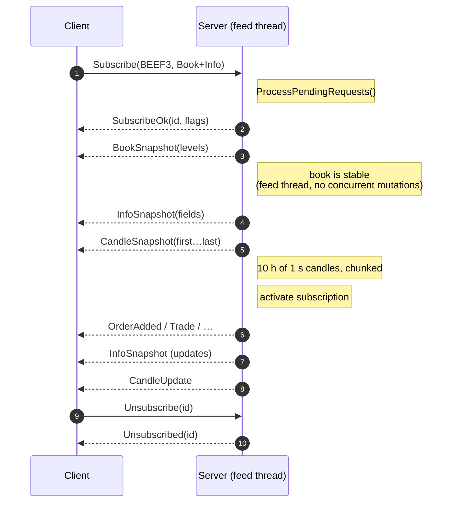
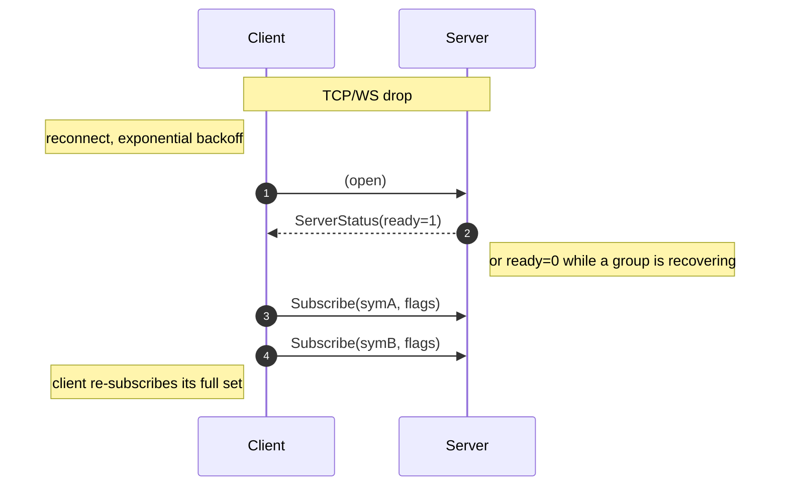

# WebSocket Binary Protocol

The server speaks a compact, length-prefixed binary protocol over a single
WebSocket. All numeric fields are **little-endian**.

- Default URL: `ws://<host>:<ws-port>/ws` (e.g. `ws://localhost:8080/ws`).
- Frames are WebSocket **binary** messages (one wire message per frame).
- Multiple wire messages may be coalesced inside a single TCP segment by the
  server's per-client `UMDF_CLIENT_COALESCE_WINDOW_MS` window.

## Framing

Every message starts with a fixed 4-byte header:

```
 0               1               2               3
 0 1 2 3 4 5 6 7 0 1 2 3 4 5 6 7 0 1 2 3 4 5 6 7 0 1 2 3 4 5 6 7
+-+-+-+-+-+-+-+-+-+-+-+-+-+-+-+-+-+-+-+-+-+-+-+-+-+-+-+-+-+-+-+-+
|       messageLength (u16)     |       messageType (u16)       |
+-+-+-+-+-+-+-+-+-+-+-+-+-+-+-+-+-+-+-+-+-+-+-+-+-+-+-+-+-+-+-+-+
|                          payload …                            |
```

- `messageLength` is the total frame size **including the header itself**.
- Maximum single message size: `65 535 bytes` (`u16`).

## Message types

```
Client → Server                 Server → Client
─────────────────────────────   ─────────────────────────────────
Subscribe         0x0001        SubscribeOk         0x0010
Unsubscribe       0x0002        SubscribeError      0x0011
Get               0x0003        Unsubscribed        0x0012
                                BookSnapshot        0x0020
                                InfoSnapshot        0x0021
                                LevelSnapshot       0x0022
                                OrderAdded          0x0030
                                OrderUpdated        0x0031
                                 OrderDeleted        0x0032
                                 Trade               0x0033
                                 BookCleared         0x0034
                                 MarketTierUpdate    0x0036
                                 LevelUpdate         0x0037
                                 LevelDeleted        0x0038
                                 RankingsUpdate      0x0040
                                ServerStatus        0x0050
                                CandleSnapshot      0x0060
                                CandleUpdate        0x0061
                                NewsBegin           0x0090
                                NewsChunk           0x0091
                                NewsEnd             0x0092
```

## Client → Server

| Message | Type | Payload |
|---------|------|---------|
| **Subscribe**   | `0x0001` | `[flags u8][symLen u8][symbol UTF-8…]` |
| **Unsubscribe** | `0x0002` | `[securityId u64]` |
| **Get**         | `0x0003` | `[flags u8][symLen u8][symbol UTF-8…]` |

`flags` is a `DataFlags` bitmask:

| Value | Name | Meaning |
|-------|------|---------|
| `0x00` | None | Treated as `All` |
| `0x01` | Book | `BookSnapshot` + order incrementals (`OrderAdded`/`Updated`/`Deleted`, `MarketTierUpdate`, `BookCleared`). **Does NOT include `Trade`/`TradeBust`** — those require `Trades` (`0x10`). |
| `0x02` | Info | `InfoSnapshot` + incremental market-data / status updates |
| `0x03` | All  | `Book` + `Info` (legacy default; **does not** include News, MBP, or Trades) |
| `0x04` | News | `NewsBegin` / `NewsChunk` / `NewsEnd` reassembled news deliveries (per-symbol *and* global) |
| `0x08` | Mbp | `LevelSnapshot` + `LevelUpdate`/`LevelDeleted` aggregated price-level stream (conflated by `(secId, side, price)`). See [`docs/perf/mbp-stream.md`](perf/mbp-stream.md). Shared frames (`BookCleared`, `MarketTierUpdate`, `CandleUpdate`) are also delivered. **Does NOT include `Trade`/`TradeBust`** — those require `Trades` (`0x10`). |
| `0x10` | Trades | Trade prints (`Trade`) + corrections (`TradeBust`) + per-symbol recent-trades history snapshot on subscribe. Independent of `Book`/`Mbp` — opt in to receive live tape. Note: `LastTradePrice`/`LastTradeSize` in `InfoSnapshot` belong to `Info`, not this flag. |
| `0x1F` | Everything | `Book` + `Info` + `News` + `Mbp` + `Trades` |

> **News and Trades are opt-in.** Existing clients that send `0x03` (or
> `0x00`) keep the legacy behaviour and never receive news or trade frames.
> Set the `News` / `Trades` bits explicitly to enable.
>
> ⚠️ **Breaking change (Trades opt-in)**: prior to this version, `Book` and
> `Mbp` subscribers automatically received `Trade`/`TradeBust` as "shared"
> frames. They no longer do. Clients that want the trade tape must set the
> `Trades` (`0x10`) bit. Combine freely: e.g. `Book|Trades` (`0x11`),
> `Mbp|Trades` (`0x18`), `Book|Mbp|Trades` (`0x19`), or `Trades` alone
> (`0x10`) for a tape-only client.

Behavior:

- **Subscribe** → server replies with `SubscribeOk` + initial snapshot(s) + ongoing incrementals filtered by `flags`. Persists until `Unsubscribe` or disconnect.
- **Get** → server replies with snapshot(s) only; no subscription is created.
- **Unsubscribe** uses the `securityId` returned in the previous `SubscribeOk`.

### Hex example — Subscribe `BEEF3` (Book + Info)

```
 0c 00 01 00 03 05 42 45 45 46 33
 └──┬──┘└──┬──┘ │  │  └────┬────┘
   len   type  fl ln    "BEEF3"
   12    0x01  All 5
```

Total length = 12 bytes (4 header + 1 flags + 1 symLen + 5 symbol).

## Server → Client

### Lifecycle / control

| Message | Type | Payload |
|---------|------|---------|
| **ServerStatus**   | `0x0050` | `[ready u8]` |
| **SubscribeOk**    | `0x0010` | `[securityId u64][flags u8][symLen u8][symbol UTF-8…]` |
| **SubscribeError** | `0x0011` | `[errorCode u8][symLen u8][symbol UTF-8…]` |
| **Unsubscribed**   | `0x0012` | `[securityId u64]` |

`ServerStatus.ready` = `1` once **every** feed group is in `RealTime`,
`0` otherwise. The server emits one immediately on connect and again on
each transition. Clients should treat `ready=0` as "do not subscribe yet,
do not consume incrementals" and re-subscribe on the rising edge.

`SubscribeError.errorCode`:

| Code | Name | Meaning |
|------|------|---------|
| `0x01` | `UnknownSymbol` | Symbol is not registered in `SymbolRegistry` |
| `0x02` | `NotReady`      | Server has not reached `RealTime` for the owning group |

### Snapshots

| Message | Type | Payload |
|---------|------|---------|
| **BookSnapshot** | `0x0020` | `[secId u64][rptSeq u32][bidCount u16][askCount u16][level × N]` |
| **InfoSnapshot** | `0x0021` | `[secId u64][fieldMask u32][value i64 × popcount(mask)]` |
| **LevelSnapshot** | `0x0022` | `[secId u64][bidCount u16][askCount u16][bid × bidCount][ask × askCount]` — each level is `[price i64][totalQty i64][orderCount u32]` (20 bytes). Sent only when `DataFlags.Mbp` is set. |

Each price level is **18 bytes**: `[price i64][totalQty i64][orderCount u16]`.
The current server uses `BookSnapshot` as a reset marker (`bidCount=0`,
`askCount=0`) and then appends priced snapshot orders as `OrderAdded` frames in
the same snapshot batch. If the book has MOA/MOC null-price orders, the server
sends one `MarketTierUpdate` per non-empty side immediately after the priced
snapshot; clients should reset any prior market tier when processing
`BookSnapshot`.

`InfoSnapshot.fieldMask` bit positions:

| Bit | Field | Bit | Field |
|-----|-------|-----|-------|
| 0 | OpeningPrice | 12 | NetChange |
| 1 | ClosingPrice | 13 | NumberOfTrades |
| 2 | HighPrice | 14 | OpenInterest |
| 3 | LowPrice | 15 | PriceBandLow |
| 4 | LastTradePrice | 16 | PriceBandHigh |
| 5 | LastTradeSize | 17 | TradingReferencePrice |
| 6 | SettlementPrice | 18 | AvgDailyTradedQty |
| 7 | TheoreticalOpeningPrice | 19 | MaxTradeVol |
| 8 | TheoreticalOpeningSize | 20 | TradingStatus |
| 9 | AuctionImbalanceSize | 21 | TradingEvent |
| 10 | TradeVolume | 22 | PriceLimitType |
| 11 | VwapPrice | 23 | MinPriceIncrement |
|    |                         | 24 | AuctionImbalanceCondition |

Only fields with their bit set are present in the payload (as `i64` in
bit order). Max `InfoSnapshot` body: 200 bytes.

`AuctionImbalanceCondition` carries the raw SBE `ImbalanceCondition`
bitfield from `AuctionImbalance_19` (low 16 bits): `0x0100` =
`ImbalanceMoreBuyers`, `0x0200` = `ImbalanceMoreSellers`, all bits off =
`Balanced`. The SDK decodes it into the
`B3.MarketData.WebSocketClient.AuctionImbalanceCondition` enum;
unrecognised combinations map to `Unknown`.

### Incrementals

| Message | Type | Payload |
|---------|------|---------|
| **OrderAdded**   | `0x0030` | `[secId u64][orderId u64][side u8][price i64][qty i64]` |
| **OrderUpdated** | `0x0031` | *(same as OrderAdded)* |
| **OrderDeleted** | `0x0032` | `[secId u64][orderId u64][side u8]` |
| **Trade**        | `0x0033` | `[secId u64][price i64][qty i64][tradeId i64][flags u8]` |
| **BookCleared**  | `0x0034` | `[secId u64][clearSide u8]` |
| **MarketTierUpdate** | `0x0036` | `[secId u64][side u8][totalQty i64][orderCount u32]` |
| **LevelUpdate**  | `0x0037` | `[secId u64][side u8][price i64][totalQty i64][orderCount u32]` |
| **LevelDeleted** | `0x0038` | `[secId u64][side u8][price i64]` |

For order events and `MarketTierUpdate`, `side` = `0` (Bid) or `1` (Ask).
For `BookCleared`, `clearSide` = `0` (Both), `1` (Bid), or `2` (Ask).
Prices use the SBE schema's exponents:
`Price` / `PriceOptional` = `1e-4`, `Price8` = `1e-8`. Apply
`mantissa × 10^-decimals` for display.

`Trade.flags` is a `TradeFlags` bitset:

| Bit | Name | Meaning |
|----:|------|---------|
| `0x01` | `AuctionPrint` | Trade executed during an auction phase. Set when the upstream SBE `TradeCondition.OpeningPrice` bit is on (opening / reopening cross) **or** the security's current `TradingStatus` is `RESERVED` (pre-open) or `FINAL_CLOSING_CALL`. |

All other bits are reserved (must be 0). Clients MUST mask with the
documented bit values rather than equality-checking the whole byte.
Servers that predate the flag byte wrote the legacy 36-byte `Trade`
frame; the framing header reports the true length, and decoders that
read flags MUST treat absence as `0` (no flags set). Trade history
frames replayed from the per-symbol recent-trades ring always carry
`flags=0` (the ring does not persist per-trade flags).

`MarketTierUpdate` represents B3 null-price MOA/MOC orders as an aggregate
market tier per side. It is intentionally separate from priced order events:
do not insert it into price-level sorting, and do not use sentinel prices such
as `0`, `±∞`, or `null` inside the priced ladder. Render it as a distinct
`MKT`/`MOA-MOC` tier above the priced levels for that side.

### Aggregates

| Message | Type | Payload |
|---------|------|---------|
| **RankingsUpdate** | `0x0040` | `[volCount u8][entry…][gainerCount u8][entry…][loserCount u8][entry…]` |
| **CandleSnapshot** | `0x0060` | `[secId u64][resolution u16][flags u8][count u16][candle × N]` |
| **CandleUpdate**   | `0x0061` | `[secId u64][resolution u16][candle]` |

Each ranking `entry` (variable size): `[secId u64][value i64][symLen u8][symbol UTF-8…]`.
Up to 10 entries per category. `RankingsUpdate` is broadcast every 2 s to
all connected clients.

A `Candle` is **48 bytes**: `[time i64][open i64][high i64][low i64][close i64][volume i64]`.
The server retains **the last 10 hours of 1 s candles per instrument**. On
subscribe (with `Book` flag) the entire window is delivered as a sequence
of `CandleSnapshot` frames:

- Each snapshot carries up to **1364 candles** (the per-message limit
  imposed by the `u16` framing length).
- `flags`:
  - `0x01` (`First`) — first batch of the snapshot; client should reset
    its candle buffer for that security.
  - `0x02` (`Last`) — final batch.
- After the snapshot, live `CandleUpdate` messages stream the most recent
  bucket as it ticks.

### News (opt-in via `DataFlags.News`)

News deliveries are split across three message types so that bodies larger
than the `u16` framing length (~64 KiB) still fit in the protocol. A single
logical news item is emitted as exactly one `NewsBegin`, then `N`
`NewsChunk` frames (one or more per field, in `Headline → Text → URL`
order), then exactly one `NewsEnd` (which carries the *last* fragment of
the URL field). Each frame starts with a `u8` version byte (current
version: `1`).

| Message | Type | Payload (after framing header) |
|---------|------|--------------------------------|
| **NewsBegin** | `0x0090` | `[ver u8][secId u64 (0 = global)][newsId u64 (0 = no id)][source u8][language u16][origTimeNanos i64][totalHeadlineLen u32][totalTextLen u32][totalUrlLen u32]` |
| **NewsChunk** | `0x0091` | `[ver u8][newsId u64][field u8][fragLen u16][fragment bytes]` |
| **NewsEnd**   | `0x0092` | *(same layout as NewsChunk; signals the final fragment of the news)* |

`field` discriminator: `0` = Headline, `1` = Text, `2` = URL. Fragments
within a field arrive contiguously and in order. Fragment payload size is
capped at **60 KiB** per chunk; clients should buffer per-`(newsId, field)`
until the next field starts (or `NewsEnd` arrives) and concatenate.

Routing:

- `secId != 0` — delivered only to clients subscribed to that `securityId`
  with the `News` flag set.
- `secId == 0` — global news; delivered to *every* connected client that
  has the `News` flag set on **any** subscription. The server keeps a
  per-session refcount so this is an O(clients) check, not O(securities).

Clients with the `News` flag will not receive news that arrives **before**
they subscribe — the server has no replay buffer for news.

## Subscription flow



Snapshot delivery happens **on the feed thread** before activating the
subscription, guaranteeing no race between snapshot and incrementals.

## Reconnect / recovery flow



While a group is bootstrapping (`FeedState = WaitInstrumentDefinition`)
or while a market-wide event has flipped a large fraction of symbols
to `Stale` (mass-stale fanout gate, default ≥ 50 % of known symbols),
**fanout to subscribers of that group is suppressed**. On the rising
edge back to a publishing state, every Book subscriber in the group
receives a fresh `BookSnapshot`. There is no channel-level Recovery
state on individual gaps — those are healed per-symbol without
suppressing fanout. See
[RESILIENCE.md §4](RESILIENCE.md#4-cascading-recovery--eliminated-by-per-instrument-heal)
for the full design.

## Slow-consumer disconnect

If a client exceeds `UMDF_CLIENT_MAX_PENDING_BYTES` (default 4 MiB of
unsent data buffered server-side), or is consistently above the queue
threshold for `UMDF_SLOW_CLIENT_MAX_TICKS` write cycles, the server
closes the WebSocket with:

- Close code: `1008` (`PolicyViolation`)
- Reason: `"slow consumer"`

The client should reconnect, optionally back off, and re-subscribe; it
will receive fresh snapshots and resume cleanly. Full layered design in
[RESILIENCE.md](RESILIENCE.md#slow-consumer-protection).
