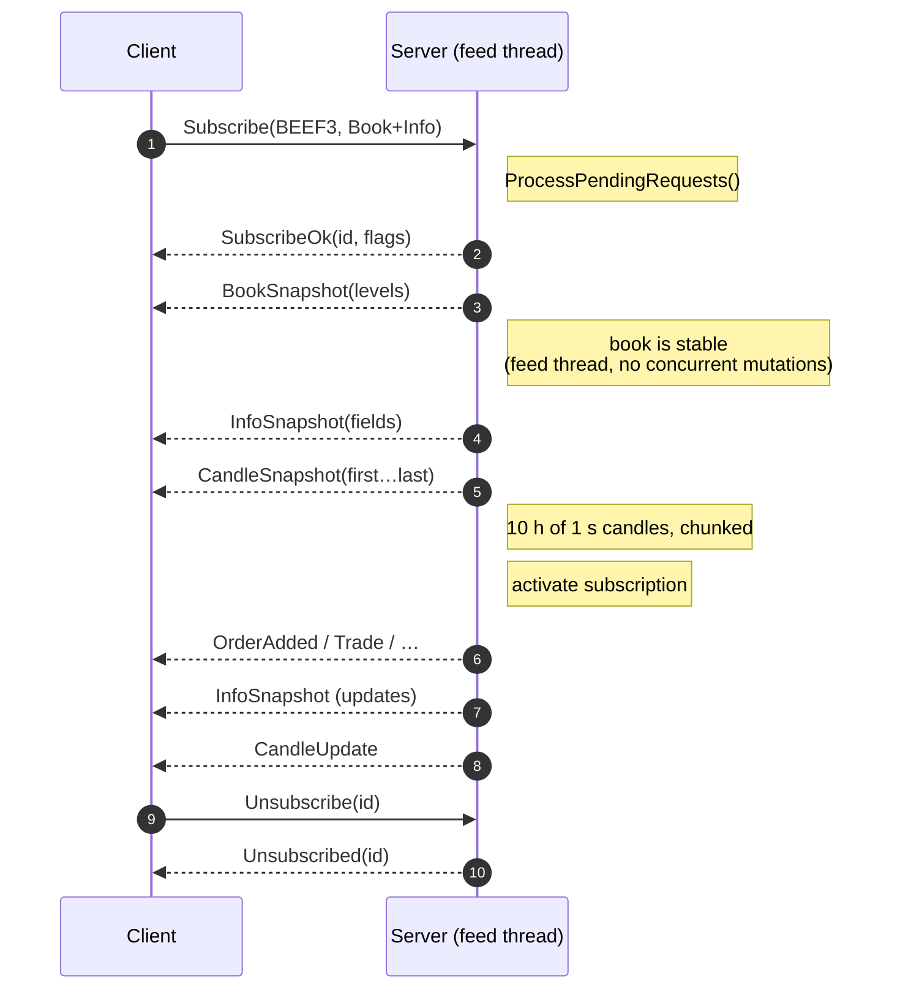
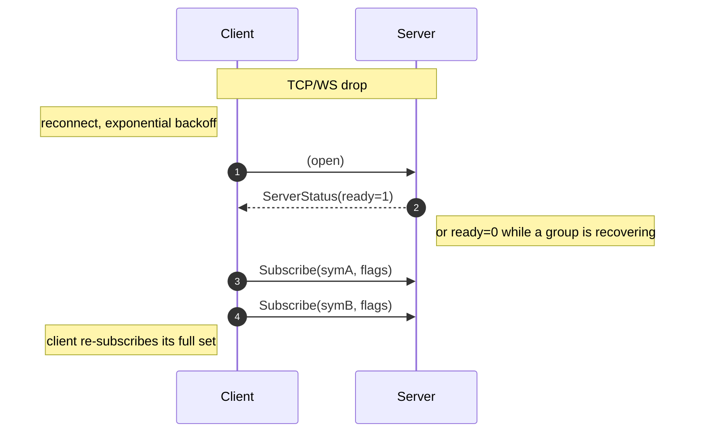

# WebSocket Binary Protocol

The server speaks a compact, length-prefixed binary protocol over a single
WebSocket. All numeric fields are **little-endian**.

- Default URL: `ws://<host>:<ws-port>/ws` (e.g. `ws://localhost:8080/ws`).
- Frames are WebSocket **binary** messages (one wire message per frame).
- Multiple wire messages may be coalesced inside a single TCP segment by the
  server's per-client `UMDF_CLIENT_COALESCE_WINDOW_MS` window.

## Framing

Every message starts with a fixed 4-byte header:

```
 0               1               2               3
 0 1 2 3 4 5 6 7 0 1 2 3 4 5 6 7 0 1 2 3 4 5 6 7 0 1 2 3 4 5 6 7
+-+-+-+-+-+-+-+-+-+-+-+-+-+-+-+-+-+-+-+-+-+-+-+-+-+-+-+-+-+-+-+-+
|       messageLength (u16)     |       messageType (u16)       |
+-+-+-+-+-+-+-+-+-+-+-+-+-+-+-+-+-+-+-+-+-+-+-+-+-+-+-+-+-+-+-+-+
|                          payload …                            |
```

- `messageLength` is the total frame size **including the header itself**.
- Maximum single message size: `65 535 bytes` (`u16`).

## Message types

```
Client → Server                 Server → Client
─────────────────────────────   ─────────────────────────────────
Subscribe         0x0001        SubscribeOk         0x0010
Unsubscribe       0x0002        SubscribeError      0x0011
Get               0x0003        Unsubscribed        0x0012
                                BookSnapshot        0x0020
                                InfoSnapshot        0x0021
                                OrderAdded          0x0030
                                OrderUpdated        0x0031
                                OrderDeleted        0x0032
                                Trade               0x0033
                                BookCleared         0x0034
                                RankingsUpdate      0x0040
                                ServerStatus        0x0050
                                CandleSnapshot      0x0060
                                CandleUpdate        0x0061
```

## Client → Server

| Message | Type | Payload |
|---------|------|---------|
| **Subscribe**   | `0x0001` | `[flags u8][symLen u8][symbol UTF-8…]` |
| **Unsubscribe** | `0x0002` | `[securityId u64]` |
| **Get**         | `0x0003` | `[flags u8][symLen u8][symbol UTF-8…]` |

`flags` is a `DataFlags` bitmask:

| Value | Name | Meaning |
|-------|------|---------|
| `0x00` | None | Treated as `All` |
| `0x01` | Book | `BookSnapshot` + order incrementals (`OrderAdded`/`Updated`/`Deleted`, `Trade`, `BookCleared`) |
| `0x02` | Info | `InfoSnapshot` + incremental market-data / status updates |
| `0x03` | All  | Both channels |

Behavior:

- **Subscribe** → server replies with `SubscribeOk` + initial snapshot(s) + ongoing incrementals filtered by `flags`. Persists until `Unsubscribe` or disconnect.
- **Get** → server replies with snapshot(s) only; no subscription is created.
- **Unsubscribe** uses the `securityId` returned in the previous `SubscribeOk`.

### Hex example — Subscribe `BEEF3` (Book + Info)

```
 0c 00 01 00 03 05 42 45 45 46 33
 └──┬──┘└──┬──┘ │  │  └────┬────┘
   len   type  fl ln    "BEEF3"
   12    0x01  All 5
```

Total length = 12 bytes (4 header + 1 flags + 1 symLen + 5 symbol).

## Server → Client

### Lifecycle / control

| Message | Type | Payload |
|---------|------|---------|
| **ServerStatus**   | `0x0050` | `[ready u8]` |
| **SubscribeOk**    | `0x0010` | `[securityId u64][flags u8][symLen u8][symbol UTF-8…]` |
| **SubscribeError** | `0x0011` | `[errorCode u8][symLen u8][symbol UTF-8…]` |
| **Unsubscribed**   | `0x0012` | `[securityId u64]` |

`ServerStatus.ready` = `1` once **every** feed group is in `RealTime`,
`0` otherwise. The server emits one immediately on connect and again on
each transition. Clients should treat `ready=0` as "do not subscribe yet,
do not consume incrementals" and re-subscribe on the rising edge.

`SubscribeError.errorCode`:

| Code | Name | Meaning |
|------|------|---------|
| `0x01` | `UnknownSymbol` | Symbol is not registered in `SymbolRegistry` |
| `0x02` | `NotReady`      | Server has not reached `RealTime` for the owning group |

### Snapshots

| Message | Type | Payload |
|---------|------|---------|
| **BookSnapshot** | `0x0020` | `[secId u64][rptSeq u32][bidCount u16][askCount u16][level × N]` |
| **InfoSnapshot** | `0x0021` | `[secId u64][fieldMask u32][value i64 × popcount(mask)]` |

Each price level is **18 bytes**: `[price i64][totalQty i64][orderCount u16]`.

`InfoSnapshot.fieldMask` bit positions:

| Bit | Field | Bit | Field |
|-----|-------|-----|-------|
| 0 | OpeningPrice | 11 | VwapPrice |
| 1 | ClosingPrice | 12 | NetChange |
| 2 | HighPrice | 13 | NumberOfTrades |
| 3 | LowPrice | 14 | OpenInterest |
| 4 | LastTradePrice | 15 | PriceBandLow |
| 5 | LastTradeSize | 16 | PriceBandHigh |
| 6 | SettlementPrice | 17 | TradingReferencePrice |
| 7 | TheoreticalOpeningPrice | 18 | AvgDailyTradedQty |
| 8 | TheoreticalOpeningSize | 19 | MaxTradeVol |
| 9 | AuctionImbalanceSize | 20 | TradingStatus |
| 10 | TradeVolume | 21 | TradingEvent |

Only fields with their bit set are present in the payload (as `i64` in
bit order). Max `InfoSnapshot` body: 192 bytes.

### Incrementals

| Message | Type | Payload |
|---------|------|---------|
| **OrderAdded**   | `0x0030` | `[secId u64][orderId u64][side u8][price i64][qty i64]` |
| **OrderUpdated** | `0x0031` | *(same as OrderAdded)* |
| **OrderDeleted** | `0x0032` | `[secId u64][orderId u64][side u8]` |
| **Trade**        | `0x0033` | `[secId u64][price i64][qty i64][tradeId i64]` |
| **BookCleared**  | `0x0034` | `[secId u64]` |

`side` = `1` (Bid) or `2` (Ask). Prices use the SBE schema's exponents:
`Price` / `PriceOptional` = `1e-4`, `Price8` = `1e-8`. Apply
`mantissa × 10^-decimals` for display.

### Aggregates

| Message | Type | Payload |
|---------|------|---------|
| **RankingsUpdate** | `0x0040` | `[volCount u8][entry…][gainerCount u8][entry…][loserCount u8][entry…]` |
| **CandleSnapshot** | `0x0060` | `[secId u64][resolution u16][flags u8][count u16][candle × N]` |
| **CandleUpdate**   | `0x0061` | `[secId u64][resolution u16][candle]` |

Each ranking `entry` (variable size): `[secId u64][value i64][symLen u8][symbol UTF-8…]`.
Up to 10 entries per category. `RankingsUpdate` is broadcast every 2 s to
all connected clients.

A `Candle` is **48 bytes**: `[time i64][open i64][high i64][low i64][close i64][volume i64]`.
The server retains **the last 10 hours of 1 s candles per instrument**. On
subscribe (with `Book` flag) the entire window is delivered as a sequence
of `CandleSnapshot` frames:

- Each snapshot carries up to **1364 candles** (the per-message limit
  imposed by the `u16` framing length).
- `flags`:
  - `0x01` (`First`) — first batch of the snapshot; client should reset
    its candle buffer for that security.
  - `0x02` (`Last`) — final batch.
- After the snapshot, live `CandleUpdate` messages stream the most recent
  bucket as it ticks.

## Subscription flow



Snapshot delivery happens **on the feed thread** before activating the
subscription, guaranteeing no race between snapshot and incrementals.

## Reconnect / recovery flow



While any group is in `Recovery` / `CatchUp`, **fanout to subscribers of
that group is suppressed**. On the rising edge to `RealTime`, every Book
subscriber in the group receives a fresh `BookSnapshot`, breaking the
cascading-recovery loop. See
[RESILIENCE.md](RESILIENCE.md#fanout-suppression-during-recovery)
for the full design.

## Slow-consumer disconnect

If a client exceeds `UMDF_CLIENT_MAX_PENDING_BYTES` (default 4 MiB of
unsent data buffered server-side), or is consistently above the queue
threshold for `UMDF_SLOW_CLIENT_MAX_TICKS` write cycles, the server
closes the WebSocket with:

- Close code: `1008` (`PolicyViolation`)
- Reason: `"slow consumer"`

The client should reconnect, optionally back off, and re-subscribe; it
will receive fresh snapshots and resume cleanly. Full layered design in
[RESILIENCE.md](RESILIENCE.md#slow-consumer-protection).
